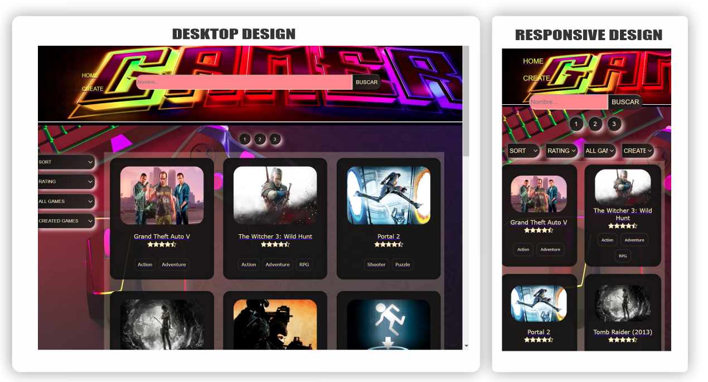
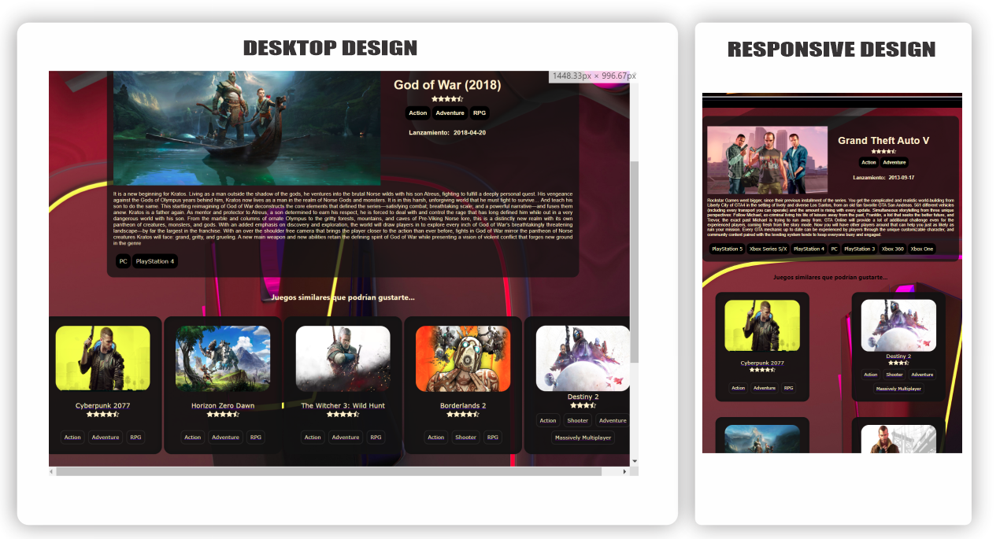

<h1 align="center">
    Individual Project - Henry Videogames
</h1>

  

Este proyecto consiste en una API de consulta sobre videojuegos.

Dentro de las funcionalidades se pueden:

- Realizar búsquedas de juegos por nombre, en donde se obtienen resultados de acuerdo a las coincidencias con la consulta.

- Desde la sección "CREATE" se pueden crear juegos adjuntado una imagen y todos los datos descriptivos.

- Desde el home se pueden ORDENAR afabéticamente y por rating de manera ascendente o descendente, FILTRAR los resultados por género u origen (juegos creados).

En caso requerir información más detallada de un juego en particular basta con pincharlo y se LINKEARÁ a la ficha con más detalle. Me pareció divertido incluir en esa sección descriptiva una lista de JUEGOS SIMILARES al consultado, siguiendo la lógica de encontrar aquellos juegos que mayor coincidencia de géneros tuviese, además de considerar similitudes con el título del juego.

  

Toda la interfaz del usuario, con DISEÑO RESPONSIVE, está desarrollada con REACT y CSS puro.

El backend fue desarrollado con EXPRESS. La información de cada juego se obtiene mediante peticiones a una API externa y también a una base de datos creada en POSTGRESQL con metodología CRUD.

El lenguaje: JAVASCRIPT, por supuesto!

- [ ] React
- [ ] Redux
- [ ] Express
- [ ] Sequelize - Postgres
- [ ] CSS

Para ver el proyecto hacé click  <a href="https://ip-videogames.vercel.app/" target="_blank">acá </a>
